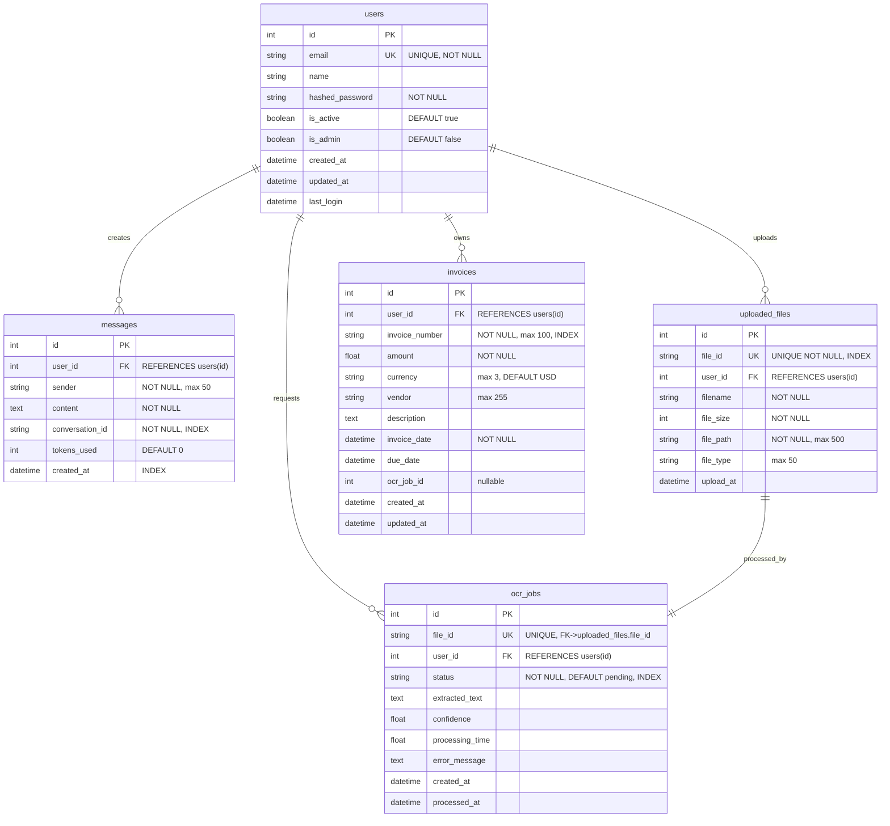
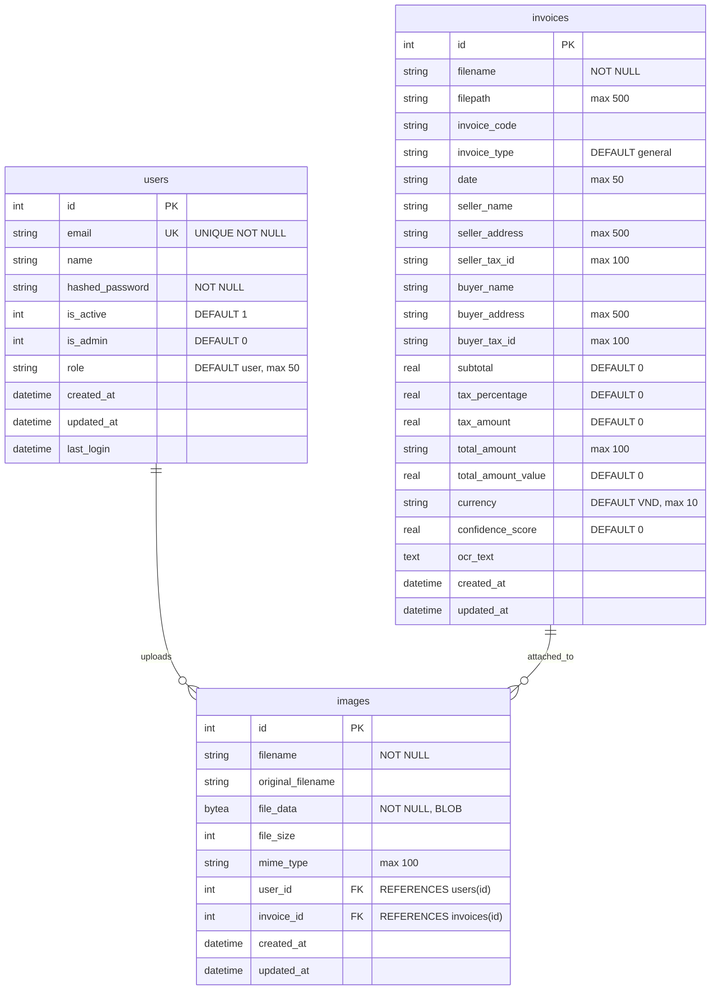

# Entity Relationship Diagram - InvoiceAI Database

## ✅ UNIFIED SCHEMA (Đã gộp)
Dự án đã được cập nhật sử dụng **1 schema thống nhất** cho cả PostgreSQL và SQLite.

### Các bảng trong Unified Schema:
1. **users** - Authentication & user management (có thêm `role`)
2. **messages** - Chat/conversation history
3. **uploaded_files** - File upload metadata
4. **ocr_jobs** - OCR processing queue/status
5. **invoices** - **UNIFIED** - Gộp cả invoice management + OCR extracted data
6. **images** - Binary image storage với FK đến users và invoices

### Thay đổi chính:
- ✅ `invoices.user_id` bây giờ là **REQUIRED** (không còn orphaned data)
- ✅ `users.role` đã được thêm vào
- ✅ `invoices` có đầy đủ fields từ cả 2 schema cũ
- ✅ `images` có FK constraints đúng đắn
- ✅ Tất cả FK constraints và indexes đã được tối ưu

---

## 🎨 DBML Format cho dbdiagram.io

### Link công cụ: [https://dbdiagram.io/](https://dbdiagram.io/)

### Schema A: Alembic Migration System

```dbml
// ========================================
// SCHEMA A: Alembic Migration System
// ========================================

Table users as U {
  id int [pk]
  email varchar(255) [unique, not null]
  name varchar(255)
  hashed_password varchar(255) [not null]
  is_active boolean [default: true]
  is_admin boolean [default: false]
  created_at timestamp
  updated_at timestamp
  last_login timestamp
  
  indexes {
    (id) [name: 'ix_users_id']
    (email) [name: 'ix_users_email']
  }
}

Table messages as M {
  id int [pk]
  user_id int [not null]
  sender varchar(50) [not null]
  content text [not null]
  conversation_id varchar(255) [not null]
  tokens_used int [default: 0]
  created_at timestamp
  
  indexes {
    (id) [name: 'ix_messages_id']
    (user_id) [name: 'ix_messages_user_id']
    (conversation_id) [name: 'ix_messages_conversation_id']
    (created_at) [name: 'ix_messages_created_at']
  }
}

Table uploaded_files as UF {
  id int [pk]
  file_id varchar(255) [unique, not null]
  user_id int [not null]
  filename varchar(255) [not null]
  file_size int [not null]
  file_path varchar(500) [not null]
  file_type varchar(50)
  upload_at timestamp
  
  indexes {
    (id) [name: 'ix_uploaded_files_id']
    (file_id) [unique, name: 'ix_uploaded_files_file_id']
    (user_id) [name: 'ix_uploaded_files_user_id']
  }
}

Table ocr_jobs as OJ {
  id int [pk]
  file_id varchar(255) [unique, not null]
  user_id int [not null]
  status varchar(20) [not null, default: 'pending']
  extracted_text text
  confidence float
  processing_time float
  error_message text
  created_at timestamp
  processed_at timestamp
  
  indexes {
    (id) [name: 'ix_ocr_jobs_id']
    (file_id) [unique, name: 'ix_ocr_jobs_file_id']
    (user_id) [name: 'ix_ocr_jobs_user_id']
    (status) [name: 'ix_ocr_jobs_status']
  }
}

Table invoices_alembic as IA {
  id int [pk]
  user_id int [not null]
  invoice_number varchar(100) [not null]
  amount float [not null]
  currency varchar(3) [default: 'USD']
  vendor varchar(255)
  description text
  invoice_date timestamp [not null]
  due_date timestamp
  ocr_job_id int
  created_at timestamp
  updated_at timestamp
  
  indexes {
    (id) [name: 'ix_invoices_id']
    (user_id) [name: 'ix_invoices_user_id']
    (invoice_number) [name: 'ix_invoices_invoice_number']
  }
}

// Relationships for Schema A
Ref: M.user_id > U.id
Ref: UF.user_id > U.id
Ref: OJ.user_id > U.id
Ref: OJ.file_id - UF.file_id
Ref: IA.user_id > U.id
```

### Schema B: Database Tools (OCR/Invoice Processing)

```dbml
// ========================================
// SCHEMA B: Database Tools - OCR/Invoice Processing
// ========================================

Table users_tools as UT {
  id int [pk]
  email varchar(255) [unique, not null]
  name varchar(255)
  hashed_password varchar(255) [not null]
  is_active int [default: 1]
  is_admin int [default: 0]
  role varchar(50) [default: 'user']
  created_at timestamp
  updated_at timestamp
  last_login timestamp
}

Table invoices_tools as IT {
  id int [pk]
  filename varchar(255) [not null]
  filepath varchar(500)
  invoice_code varchar(255)
  invoice_type varchar(100) [default: 'general']
  date varchar(50)
  seller_name varchar(255)
  seller_address varchar(500)
  seller_tax_id varchar(100)
  buyer_name varchar(255)
  buyer_address varchar(500)
  buyer_tax_id varchar(100)
  subtotal real [default: 0]
  tax_percentage real [default: 0]
  tax_amount real [default: 0]
  total_amount varchar(100)
  total_amount_value real [default: 0]
  currency varchar(10) [default: 'VND']
  confidence_score real [default: 0]
  ocr_text text
  created_at timestamp
  updated_at timestamp
}

Table images as IMG {
  id int [pk]
  filename varchar(255) [not null]
  original_filename varchar(255)
  file_data bytea [not null]
  file_size int
  mime_type varchar(100)
  user_id int
  invoice_id int
  created_at timestamp
  updated_at timestamp
}

// Relationships for Schema B
Ref: IMG.user_id > UT.id
Ref: IMG.invoice_id > IT.id
```

---

### 🔥 Schema C: Unified Cloud Schema (KHUYẾN NGHỊ)

**Đây là schema thống nhất, merge cả A + B, sửa hết mâu thuẫn:**

```dbml
// ========================================
// SCHEMA C: UNIFIED CLOUD SCHEMA
// Merge Schema A + B, Fix all conflicts
// Ready for Production Deployment
// ========================================

Table users {
  id int [pk]
  email varchar(255) [unique, not null]
  name varchar(255)
  hashed_password varchar(255) [not null]
  is_active boolean [default: true]
  is_admin boolean [default: false]
  role varchar(50) [default: 'user']
  created_at timestamp
  updated_at timestamp
  last_login timestamp
  
  indexes {
    (email) [unique, name: 'idx_users_email']
    (role) [name: 'idx_users_role']
  }
  Note: 'Unified user table with role field'
}

Table messages {
  id int [pk]
  user_id int [not null]
  sender varchar(50) [not null]
  content text [not null]
  conversation_id varchar(255) [not null]
  tokens_used int [default: 0]
  created_at timestamp
  
  indexes {
    (user_id) [name: 'idx_messages_user_id']
    (conversation_id) [name: 'idx_messages_conversation_id']
    (created_at) [name: 'idx_messages_created_at']
  }
  Note: 'Chat conversation history'
}

Table uploaded_files {
  id int [pk]
  file_id varchar(255) [unique, not null]
  user_id int [not null]
  filename varchar(255) [not null]
  original_filename varchar(255)
  file_size int [not null]
  file_path varchar(500) [not null]
  file_type varchar(50)
  mime_type varchar(100)
  upload_at timestamp
  
  indexes {
    (file_id) [unique, name: 'idx_uploaded_files_file_id']
    (user_id) [name: 'idx_uploaded_files_user_id']
  }
  Note: 'File upload metadata - for OCR processing'
}

Table ocr_jobs {
  id int [pk]
  file_id varchar(255) [unique, not null]
  user_id int [not null]
  status varchar(20) [not null, default: 'pending']
  extracted_text text
  confidence float
  processing_time float
  error_message text
  created_at timestamp
  processed_at timestamp
  
  indexes {
    (file_id) [unique, name: 'idx_ocr_jobs_file_id']
    (user_id) [name: 'idx_ocr_jobs_user_id']
    (status) [name: 'idx_ocr_jobs_status']
    (created_at) [name: 'idx_ocr_jobs_created']
  }
  Note: 'OCR processing jobs with status tracking'
}

Table invoices {
  id int [pk]
  user_id int [not null]
  ocr_job_id int
  file_id varchar(255)
  filename varchar(255)
  filepath varchar(500)
  invoice_number varchar(100)
  invoice_code varchar(255)
  invoice_type varchar(100) [default: 'general']
  invoice_date timestamp
  due_date timestamp
  date_string varchar(50)
  seller_name varchar(255)
  seller_address varchar(500)
  seller_tax_id varchar(100)
  buyer_name varchar(255)
  buyer_address varchar(500)
  buyer_tax_id varchar(100)
  subtotal float [default: 0]
  tax_percentage float [default: 0]
  tax_amount float [default: 0]
  total_amount varchar(100)
  total_amount_value float [default: 0]
  currency varchar(10) [default: 'VND']
  vendor varchar(255)
  description text
  confidence_score float [default: 0]
  ocr_text text
  created_at timestamp
  updated_at timestamp
  
  indexes {
    (user_id) [name: 'idx_invoices_user_id']
    (ocr_job_id) [name: 'idx_invoices_ocr_job']
    (invoice_number) [name: 'idx_invoices_number']
    (invoice_code) [name: 'idx_invoices_code']
    (invoice_type) [name: 'idx_invoices_type']
    (invoice_date) [name: 'idx_invoices_date']
    (created_at) [name: 'idx_invoices_created']
  }
  Note: 'Unified invoices - merge both schemas with full OCR data'
}

Table images {
  id int [pk]
  user_id int [not null]
  invoice_id int
  uploaded_file_id int
  filename varchar(255) [not null]
  original_filename varchar(255)
  file_path varchar(500)
  file_data bytea
  file_size int
  mime_type varchar(100)
  storage_type varchar(20) [default: 'filesystem']
  created_at timestamp
  updated_at timestamp
  
  indexes {
    (user_id) [name: 'idx_images_user_id']
    (invoice_id) [name: 'idx_images_invoice_id']
    (uploaded_file_id) [name: 'idx_images_uploaded_file']
    (created_at) [name: 'idx_images_created']
  }
  Note: 'Image storage - support both filesystem and binary'
}

// ============================================
// RELATIONSHIPS - Unified Schema
// ============================================

// User relationships
Ref: messages.user_id > users.id [delete: cascade]
Ref: uploaded_files.user_id > users.id [delete: cascade]
Ref: ocr_jobs.user_id > users.id [delete: cascade]
Ref: invoices.user_id > users.id [delete: restrict]
Ref: images.user_id > users.id [delete: cascade]

// File processing pipeline
Ref: ocr_jobs.file_id - uploaded_files.file_id [delete: cascade]
Ref: invoices.ocr_job_id > ocr_jobs.id [delete: set null]
Ref: invoices.file_id > uploaded_files.file_id [delete: set null]

// Image relationships
Ref: images.invoice_id > invoices.id [delete: set null]
Ref: images.uploaded_file_id > uploaded_files.id [delete: set null]

// ============================================
// NOTES:
// - Added user_id to invoices (fix Schema B issue)
// - Added role field to users (fix Schema A issue)  
// - Added FK constraint for ocr_job_id (fix integrity issue)
// - Unified invoices with fields from both schemas
// - Support both filesystem and binary storage for images
// - Added proper indexes for all foreign keys
// - Added cascade delete rules for data cleanup
// ============================================
```

### 🎯 Migration Plan để chuyển sang Schema C:

```sql
-- ============================================
-- UNIFIED SCHEMA MIGRATION SCRIPT
-- Merge Schema A + Schema B → Schema C
-- ============================================

-- PHASE 1: BACKUP EXISTING DATA
-- ============================================
CREATE TABLE backup_invoices_alembic AS SELECT * FROM invoices WHERE user_id IS NOT NULL;
CREATE TABLE backup_invoices_tools AS SELECT * FROM invoices WHERE user_id IS NULL;
CREATE TABLE backup_users AS SELECT * FROM users;
CREATE TABLE backup_images AS SELECT * FROM images;

-- PHASE 2: FIX USERS TABLE (Add missing fields)
-- ============================================
-- Add role field if not exists
ALTER TABLE users ADD COLUMN IF NOT EXISTS role VARCHAR(50) DEFAULT 'user';

-- Convert is_active and is_admin from INTEGER to BOOLEAN if needed (PostgreSQL)
-- ALTER TABLE users ALTER COLUMN is_active TYPE BOOLEAN USING is_active::boolean;
-- ALTER TABLE users ALTER COLUMN is_admin TYPE BOOLEAN USING is_admin::boolean;

-- Create missing indexes
CREATE INDEX IF NOT EXISTS idx_users_email ON users(email);
CREATE INDEX IF NOT EXISTS idx_users_role ON users(role);

-- PHASE 3: CREATE UNIFIED INVOICES TABLE
-- ============================================
-- Drop old invoices table and recreate with merged schema
ALTER TABLE IF EXISTS images DROP CONSTRAINT IF EXISTS images_invoice_id_fkey;
DROP TABLE IF EXISTS invoices CASCADE;

CREATE TABLE invoices (
    id SERIAL PRIMARY KEY,
    user_id INTEGER NOT NULL REFERENCES users(id) ON DELETE RESTRICT,
    ocr_job_id INTEGER REFERENCES ocr_jobs(id) ON DELETE SET NULL,
    file_id VARCHAR(255) REFERENCES uploaded_files(file_id) ON DELETE SET NULL,
    
    -- From Schema A (Alembic)
    invoice_number VARCHAR(100),
    amount FLOAT,
    vendor VARCHAR(255),
    description TEXT,
    invoice_date TIMESTAMP,
    due_date TIMESTAMP,
    
    -- From Schema B (Database Tools - OCR)
    filename VARCHAR(255),
    filepath VARCHAR(500),
    invoice_code VARCHAR(255),
    invoice_type VARCHAR(100) DEFAULT 'general',
    date_string VARCHAR(50),
    
    -- Seller info
    seller_name VARCHAR(255),
    seller_address VARCHAR(500),
    seller_tax_id VARCHAR(100),
    
    -- Buyer info
    buyer_name VARCHAR(255),
    buyer_address VARCHAR(500),
    buyer_tax_id VARCHAR(100),
    
    -- Financial fields
    subtotal FLOAT DEFAULT 0,
    tax_percentage FLOAT DEFAULT 0,
    tax_amount FLOAT DEFAULT 0,
    total_amount VARCHAR(100),
    total_amount_value FLOAT DEFAULT 0,
    currency VARCHAR(10) DEFAULT 'VND',
    
    -- OCR metadata
    confidence_score FLOAT DEFAULT 0,
    ocr_text TEXT,
    
    -- Timestamps
    created_at TIMESTAMP DEFAULT CURRENT_TIMESTAMP,
    updated_at TIMESTAMP DEFAULT CURRENT_TIMESTAMP
);

-- Create comprehensive indexes
CREATE INDEX idx_invoices_user_id ON invoices(user_id);
CREATE INDEX idx_invoices_ocr_job_id ON invoices(ocr_job_id);
CREATE INDEX idx_invoices_file_id ON invoices(file_id);
CREATE INDEX idx_invoices_number ON invoices(invoice_number);
CREATE INDEX idx_invoices_code ON invoices(invoice_code);
CREATE INDEX idx_invoices_type ON invoices(invoice_type);
CREATE INDEX idx_invoices_date ON invoices(invoice_date);
CREATE INDEX idx_invoices_created ON invoices(created_at);

-- PHASE 4: MIGRATE DATA TO UNIFIED INVOICES
-- ============================================

-- Strategy 1: Migrate invoices from backup_invoices_alembic (Schema A)
INSERT INTO invoices (
    user_id, ocr_job_id, invoice_number, amount, vendor, description,
    invoice_date, due_date, currency, created_at, updated_at
)
SELECT 
    user_id,
    ocr_job_id,
    invoice_number,
    amount,
    vendor,
    description,
    invoice_date,
    due_date,
    COALESCE(currency, 'USD'),
    created_at,
    updated_at
FROM backup_invoices_alembic;

-- Strategy 2: Migrate invoices from backup_invoices_tools (Schema B)
-- Need to assign user_id - options:
--   A) Use first admin user
--   B) Create a special "OCR System" user
--   C) Derive from uploaded_files if possible

-- Option A: Assign to first admin user (fallback)
DO $$
DECLARE
    default_user_id INTEGER;
BEGIN
    -- Get first admin user or create system user
    SELECT id INTO default_user_id FROM users WHERE is_admin = true ORDER BY id LIMIT 1;
    
    IF default_user_id IS NULL THEN
        -- Create system user for orphaned invoices
        INSERT INTO users (email, name, hashed_password, is_admin, role)
        VALUES ('system@invoiceai.local', 'OCR System', 'disabled', true, 'system')
        RETURNING id INTO default_user_id;
    END IF;
    
    -- Migrate Schema B invoices with default user
    INSERT INTO invoices (
        user_id, filename, filepath, invoice_code, invoice_type, date_string,
        seller_name, seller_address, seller_tax_id,
        buyer_name, buyer_address, buyer_tax_id,
        subtotal, tax_percentage, tax_amount, total_amount, total_amount_value,
        currency, confidence_score, ocr_text, created_at, updated_at
    )
    SELECT 
        default_user_id,
        filename, filepath, invoice_code, invoice_type, date,
        seller_name, seller_address, seller_tax_id,
        buyer_name, buyer_address, buyer_tax_id,
        subtotal, tax_percentage, tax_amount, total_amount, total_amount_value,
        COALESCE(currency, 'VND'),
        confidence_score, ocr_text, created_at, updated_at
    FROM backup_invoices_tools;
END $$;

-- PHASE 5: FIX IMAGES TABLE
-- ============================================
ALTER TABLE images ADD COLUMN IF NOT EXISTS uploaded_file_id INTEGER REFERENCES uploaded_files(id) ON DELETE SET NULL;
ALTER TABLE images ADD COLUMN IF NOT EXISTS file_path VARCHAR(500);
ALTER TABLE images ADD COLUMN IF NOT EXISTS storage_type VARCHAR(20) DEFAULT 'filesystem';

-- Recreate foreign keys
ALTER TABLE images DROP CONSTRAINT IF EXISTS images_user_id_fkey;
ALTER TABLE images DROP CONSTRAINT IF EXISTS images_invoice_id_fkey;
ALTER TABLE images ADD CONSTRAINT images_user_id_fkey 
    FOREIGN KEY (user_id) REFERENCES users(id) ON DELETE CASCADE;
ALTER TABLE images ADD CONSTRAINT images_invoice_id_fkey 
    FOREIGN KEY (invoice_id) REFERENCES invoices(id) ON DELETE SET NULL;

-- Create indexes
CREATE INDEX IF NOT EXISTS idx_images_user_id ON images(user_id);
CREATE INDEX IF NOT EXISTS idx_images_invoice_id ON images(invoice_id);
CREATE INDEX IF NOT EXISTS idx_images_uploaded_file ON images(uploaded_file_id);
CREATE INDEX IF NOT EXISTS idx_images_created ON images(created_at);

-- PHASE 6: ADD MISSING INDEXES FOR OTHER TABLES
-- ============================================
CREATE INDEX IF NOT EXISTS idx_messages_created ON messages(created_at);
CREATE INDEX IF NOT EXISTS idx_ocr_jobs_created ON ocr_jobs(created_at);
CREATE INDEX IF NOT EXISTS idx_uploaded_files_created ON uploaded_files(upload_at);

-- PHASE 7: DATA VALIDATION
-- ============================================
-- Check for orphaned records
SELECT 'Orphaned invoices without user' AS issue, COUNT(*) 
FROM invoices WHERE user_id NOT IN (SELECT id FROM users);

SELECT 'Orphaned images without user' AS issue, COUNT(*) 
FROM images WHERE user_id NOT IN (SELECT id FROM users);

SELECT 'Invoices without OCR link' AS issue, COUNT(*) 
FROM invoices WHERE ocr_job_id IS NOT NULL 
AND ocr_job_id NOT IN (SELECT id FROM ocr_jobs);

-- PHASE 8: CLEANUP (Optional - after verification)
-- ============================================
-- DROP TABLE IF EXISTS backup_invoices_alembic;
-- DROP TABLE IF EXISTS backup_invoices_tools;
-- DROP TABLE IF EXISTS backup_users;
-- DROP TABLE IF EXISTS backup_images;

-- PHASE 9: UPDATE STATISTICS
-- ============================================
ANALYZE users;
ANALYZE messages;
ANALYZE uploaded_files;
ANALYZE ocr_jobs;
ANALYZE invoices;
ANALYZE images;

-- ============================================
-- MIGRATION COMPLETE
-- ============================================
SELECT 'Migration completed successfully!' AS status;
SELECT 
    'Users' AS table_name, COUNT(*) AS total_records FROM users
UNION ALL
SELECT 'Messages', COUNT(*) FROM messages
UNION ALL
SELECT 'Uploaded Files', COUNT(*) FROM uploaded_files
UNION ALL
SELECT 'OCR Jobs', COUNT(*) FROM ocr_jobs
UNION ALL
SELECT 'Invoices', COUNT(*) FROM invoices
UNION ALL
SELECT 'Images', COUNT(*) FROM images;
```

### 📝 Hướng dẫn Migration cho SQLite (nếu dùng local)

```sql
-- ============================================
-- UNIFIED SCHEMA MIGRATION - SQLite Version
-- ============================================

-- PHASE 1: BACKUP
CREATE TABLE backup_invoices AS SELECT * FROM invoices;
CREATE TABLE backup_users AS SELECT * FROM users;
CREATE TABLE backup_images AS SELECT * FROM images;

-- PHASE 2: DROP and RECREATE invoices table
PRAGMA foreign_keys = OFF;

DROP TABLE IF EXISTS invoices;

CREATE TABLE invoices (
    id INTEGER PRIMARY KEY AUTOINCREMENT,
    user_id INTEGER NOT NULL,
    ocr_job_id INTEGER,
    file_id TEXT,
    invoice_number TEXT,
    invoice_code TEXT,
    invoice_type TEXT DEFAULT 'general',
    invoice_date TEXT,
    due_date TEXT,
    date_string TEXT,
    filename TEXT,
    filepath TEXT,
    seller_name TEXT,
    seller_address TEXT,
    seller_tax_id TEXT,
    buyer_name TEXT,
    buyer_address TEXT,
    buyer_tax_id TEXT,
    subtotal REAL DEFAULT 0,
    tax_percentage REAL DEFAULT 0,
    tax_amount REAL DEFAULT 0,
    total_amount TEXT,
    total_amount_value REAL DEFAULT 0,
    amount REAL,
    currency TEXT DEFAULT 'VND',
    vendor TEXT,
    description TEXT,
    confidence_score REAL DEFAULT 0,
    ocr_text TEXT,
    created_at TIMESTAMP DEFAULT CURRENT_TIMESTAMP,
    updated_at TIMESTAMP DEFAULT CURRENT_TIMESTAMP,
    FOREIGN KEY (user_id) REFERENCES users(id),
    FOREIGN KEY (ocr_job_id) REFERENCES ocr_jobs(id),
    FOREIGN KEY (file_id) REFERENCES uploaded_files(file_id)
);

CREATE INDEX idx_invoices_user_id ON invoices(user_id);
CREATE INDEX idx_invoices_code ON invoices(invoice_code);
CREATE INDEX idx_invoices_type ON invoices(invoice_type);

-- PHASE 3: MIGRATE DATA
-- Find or create system user for orphaned records
INSERT OR IGNORE INTO users (email, name, hashed_password, is_admin, role)
VALUES ('system@invoiceai.local', 'OCR System', 'disabled', 1, 'system');

-- Migrate all backup data
INSERT INTO invoices SELECT 
    id, 
    COALESCE(user_id, (SELECT id FROM users WHERE email = 'system@invoiceai.local')),
    ocr_job_id,
    file_id,
    invoice_number,
    invoice_code,
    invoice_type,
    invoice_date,
    due_date,
    date_string,
    filename,
    filepath,
    seller_name,
    seller_address,
    seller_tax_id,
    buyer_name,
    buyer_address,
    buyer_tax_id,
    subtotal,
    tax_percentage,
    tax_amount,
    total_amount,
    total_amount_value,
    amount,
    COALESCE(currency, 'VND'),
    vendor,
    description,
    confidence_score,
    ocr_text,
    created_at,
    updated_at
FROM backup_invoices;

-- Add role to users if missing
ALTER TABLE users ADD COLUMN role TEXT DEFAULT 'user';

PRAGMA foreign_keys = ON;

-- Cleanup
-- DROP TABLE backup_invoices;
-- DROP TABLE backup_users;
-- DROP TABLE backup_images;
```

### 🚀 Cách chạy Migration:

#### Cho PostgreSQL (Cloud - Railway):
```bash
# 1. Connect to database
psql $DATABASE_URL

# 2. Run migration script
\i migration_unified_schema.sql

# 3. Verify
SELECT * FROM invoices LIMIT 5;
```

#### Cho SQLite (Local):
```bash
# 1. Backup database first
cp invoiceai.db invoiceai.db.backup

# 2. Run migration
sqlite3 invoiceai.db < migration_unified_schema_sqlite.sql

# 3. Verify
sqlite3 invoiceai.db "SELECT COUNT(*) FROM invoices;"
```

### ⚠️ LƯU Ý QUAN TRỌNG:

1. **BACKUP trước khi migrate**: Script có tạo backup tables
2. **Test trên staging trước**: Không chạy trực tiếp trên production
3. **Downtime**: Cần stop application trong lúc migrate
4. **Orphaned data**: Invoices không có user_id sẽ assign cho system user
5. **Data mapping**: 
   - `date` (string) → `date_string`
   - `invoice_date` (timestamp) được giữ nguyên
   - Cả 2 field tồn tại để không mất data

### Cách sử dụng với dbdiagram.io:

1. **Truy cập**: https://dbdiagram.io/
2. **Chọn schema muốn vẽ**:
   - Copy code **Schema A** (Alembic) - 5 bảng
   - Copy code **Schema B** (Database Tools) - 3 bảng
   - Hoặc copy CẢ HAI để xem toàn bộ
3. **Paste vào editor** bên trái
4. **Diagram tự động render** bên phải
5. **Tùy chỉnh**:
   - Click table để highlight relationships
   - Drag tables để sắp xếp layout
6. **Export**: 
   - PDF (in/lưu trữ)
   - PNG (insert vào docs)
   - SQL (generate database script)

### 💡 Tips:
- **Để vẽ cả 2 schema**: Copy cả 2 code blocks liên tiếp
- **Xóa comment**: Xóa các dòng `//` nếu bị lỗi
- **Màu sắc**: Thêm `[headercolor: #3498db]` vào Table để custom màu
- **Layout**: Sử dụng "Auto Arrange" để tự động sắp xếp

### Chú thích:
- `ref: >` = One-to-Many (many records point to one)
- `ref: -` = One-to-One (unique relationship)
- `ref: <` = Many-to-One (reverse of >)
- `[pk]` = Primary Key
- `[unique]` = Unique constraint
- `[not null]` = NOT NULL constraint
- `[default: value]` = Default value

---

## Sơ đồ A: Alembic Schema (Migration System)



---

## Sơ đồ B: Database Tools Schema (OCR/Invoice Processing)



---

## Phân tích quan hệ chi tiết

### Schema A: Alembic (Migration System)

#### 1. **users → messages** (One-to-Many)
- **Cardinality**: 1 user → N messages
- **Constraint**: `messages.user_id` FK → `users.id` (NOT NULL)
- **Cascade**: Không có ON DELETE CASCADE (mặc định RESTRICT)
- **Index**: `ix_messages_user_id` (tối ưu join)
- **Business Logic**: User tạo nhiều chat messages

#### 2. **users → uploaded_files** (One-to-Many)
- **Cardinality**: 1 user → N files
- **Constraint**: `uploaded_files.user_id` FK → `users.id` (NOT NULL)
- **Unique**: `file_id` (UUID/unique identifier)
- **Index**: `ix_uploaded_files_user_id`, `ix_uploaded_files_file_id`
- **Business Logic**: User upload nhiều files để OCR

#### 3. **users → ocr_jobs** (One-to-Many)
- **Cardinality**: 1 user → N jobs
- **Constraint**: `ocr_jobs.user_id` FK → `users.id` (NOT NULL)
- **Index**: `ix_ocr_jobs_user_id`, `ix_ocr_jobs_status`
- **Business Logic**: User tạo nhiều OCR processing jobs

#### 4. **uploaded_files → ocr_jobs** (One-to-One)
- **Cardinality**: 1 file → 1 job (UNIQUE constraint)
- **Constraint**: 
  - `ocr_jobs.file_id` FK → `uploaded_files.file_id` (UNIQUE)
  - Đảm bảo mỗi file chỉ có 1 OCR job
- **Index**: `ix_ocr_jobs_file_id` (UNIQUE)
- **Business Logic**: Mỗi uploaded file được xử lý bởi đúng 1 OCR job

#### 5. **users → invoices** (One-to-Many) [Schema A]
- **Cardinality**: 1 user → N invoices
- **Constraint**: `invoices.user_id` FK → `users.id` (NOT NULL)
- **Index**: `ix_invoices_user_id`, `ix_invoices_invoice_number`
- **Fields**: invoice_number, amount, vendor, dates
- **Business Logic**: User quản lý nhiều invoices đã được OCR

---

### Schema B: Database Tools (OCR/Invoice Processing)

#### 6. **users → images** (One-to-Many)
- **Cardinality**: 1 user → N images
- **Constraint**: `images.user_id` FK → `users.id` (nullable)
- **Storage**: File data lưu trong BYTEA/BLOB (binary)
- **Business Logic**: User upload ảnh hóa đơn dạng binary

#### 7. **invoices → images** (One-to-Many)
- **Cardinality**: 1 invoice → N images
- **Constraint**: `images.invoice_id` FK → `invoices.id` (nullable)
- **Business Logic**: Một hóa đơn có thể có nhiều ảnh scan/photo
- **Note**: Invoice này KHÁC invoice trong Schema A (không có user_id)

---

## 🔴 PHÁT HIỆN MÂU THUẪN NGHIÊM TRỌNG

### Bảng `invoices` tồn tại ở 2 schema với cấu trúc KHÁC NHAU:

| Thuộc tính | Schema A (Alembic) | Schema B (Database Tools) |
|------------|-------------------|--------------------------|
| **user_id** | ✅ Có (FK) | ❌ Không có |
| **invoice_number** | ✅ Có | ❌ Không có (có invoice_code) |
| **amount** | ✅ Có | ❌ Không có |
| **filename** | ❌ Không có | ✅ Có |
| **seller/buyer info** | ❌ Không có | ✅ Có (đầy đủ) |
| **OCR fields** | ❌ Không có | ✅ Có (ocr_text, confidence) |
| **Purpose** | Invoice management | Invoice OCR extraction |

### Bảng `users` cũng khác nhau:

| Thuộc tính | Schema A (Alembic) | Schema B (Database Tools) |
|------------|-------------------|--------------------------|
| **role** | ❌ Không có | ✅ Có (DEFAULT 'user') |
| **is_active type** | Boolean | Integer (0/1) |
| **is_admin type** | Boolean | Integer (0/1) |

---

## Chi tiết Index và Constraint

### Schema A: Alembic

#### users
- **PK**: `id` (SERIAL/AUTOINCREMENT)
- **UK**: `email` (UNIQUE constraint)
- **IX**: `ix_users_id`, `ix_users_email`
- **Columns**: 9 fields, missing `role` field

#### messages  
- **PK**: `id` 
- **FK**: `user_id` → `users(id)`
- **IX**: `ix_messages_id`, `ix_messages_user_id`, `ix_messages_conversation_id`, `ix_messages_created_at`
- **Purpose**: Query optimization cho chat history

#### uploaded_files
- **PK**: `id`
- **UK**: `file_id` (UNIQUE constraint)
- **FK**: `user_id` → `users(id)`  
- **IX**: `ix_uploaded_files_id`, `ix_uploaded_files_file_id`, `ix_uploaded_files_user_id`
- **Purpose**: Fast lookup by file_id

#### ocr_jobs
- **PK**: `id`
- **UK**: `file_id` (UNIQUE - ensures 1:1 with uploaded_files)
- **FK1**: `file_id` → `uploaded_files.file_id`
- **FK2**: `user_id` → `users(id)`
- **IX**: `ix_ocr_jobs_id`, `ix_ocr_jobs_file_id`, `ix_ocr_jobs_user_id`, `ix_ocr_jobs_status`
- **Purpose**: Query by status (pending/processing/completed)

#### invoices (Schema A)
- **PK**: `id`
- **FK**: `user_id` → `users(id)`
- **IX**: `ix_invoices_id`, `ix_invoices_user_id`, `ix_invoices_invoice_number`
- **Purpose**: Invoice management per user

---

### Schema B: Database Tools

#### users
- **PK**: `id` (SERIAL/AUTOINCREMENT)
- **UK**: `email` (UNIQUE)
- **Extra**: Has `role` field (DEFAULT 'user')
- **Note**: is_active và is_admin dùng INTEGER thay vì BOOLEAN

#### invoices (Schema B)
- **PK**: `id` (SERIAL/AUTOINCREMENT)
- **No FK**: Không có user_id
- **No Index**: Ngoài PK
- **Purpose**: Store OCR extracted invoice data
- **Fields**: 21 fields bao gồm seller/buyer/tax info

#### images
- **PK**: `id` (SERIAL/AUTOINCREMENT)
- **FK1**: `user_id` → `users(id)` (nullable)
- **FK2**: `invoice_id` → `invoices(id)` (nullable)
- **No Index**: Ngoài PK
- **Storage**: BYTEA (PostgreSQL) / BLOB (SQLite)
- **Purpose**: Store binary image data

---

## 🔗 Xem ERD Online

**Link render diagram:**

🔗 **Mermaid Live Editor**: [https://mermaid.live/](https://mermaid.live/)

### Cách sử dụng:
1. Truy cập https://mermaid.live/
2. Copy code Mermaid (từ ```mermaid đến ```)
3. Paste vào editor → Diagram hiển thị tự động
4. Export dạng PNG/SVG nếu cần

---

## 📊 Tổng quan Database Architecture

### Số lượng bảng: 6 bảng (nhưng có trùng tên!)

**Schema A: Alembic Migration System (5 bảng)**
1. ✅ **users** - Authentication & user management
2. ✅ **messages** - Chat/conversation history  
3. ✅ **uploaded_files** - File upload metadata
4. ✅ **ocr_jobs** - OCR processing queue/status
5. ✅ **invoices** - Invoice management records

**Schema B: Database Tools - OCR/Groq (3 bảng)**
1. ✅ **users** - User authentication (có thêm role)
2. ✅ **invoices** - OCR extracted invoice data (KHÁC Schema A)
3. ✅ **images** - Binary image storage (BLOB/BYTEA)

---

## ⚠️ KẾT LUẬN & KHUYẾN NGHỊ (Mức độ Tiến sĩ)

### 🔴 Vấn đề nghiêm trọng:

1. **Schema Inconsistency**:
   - Có 2 hệ thống database độc lập chạy song song
   - Bảng `users` và `invoices` tồn tại ở cả 2 schema nhưng cấu trúc KHÁC NHAU
   - Không có Foreign Key nào kết nối giữa 2 schema

2. **Data Integrity Issues**:
   - `invoices` (Schema A) có `user_id` FK
   - `invoices` (Schema B) KHÔNG có `user_id` 
   - → Không thể trace invoice nào thuộc user nào trong Schema B
   - → Risk: Data orphaning, audit trail issues

3. **Normalization Violations**:
   - `uploaded_files` lưu file_path (string)
   - `images` lưu file_data (binary)
   - → Duplicate storage strategy, confusion about which to use

4. **Missing Relationships**:
   - Không có FK từ `invoices` (Schema A) → `ocr_jobs`
   - Field `ocr_job_id` trong invoices là nullable INT, không có FK constraint
   - → Referential integrity không được đảm bảo

5. **Index Optimization**:
   - Schema B (Database Tools) thiếu index hoàn toàn
   - Queries trên `invoices.invoice_code` sẽ slow (full table scan)
   - `images` không có index trên `invoice_id` hoặc `user_id`

### 💡 Khuyến nghị:

#### Ngắn hạn:
1. Document rõ ràng khi nào dùng Schema A, khi nào dùng Schema B
2. Thêm migration để sync cấu trúc `users` (thêm field `role`)
3. Thêm index cho Schema B (invoice_code, invoice_type, date)

#### Dài hạn:
1. **Unify Schema**: Merge 2 schema thành 1 consistent schema
2. **Add FK Constraints**: Link `invoices.ocr_job_id` → `ocr_jobs.id`
3. **Refactor Storage**: Chọn 1 strategy - hoặc file_path hoặc binary
4. **Add user_id**: Thêm `user_id` vào `invoices` (Schema B) với FK
5. **Create Migration Plan**: Alembic migration để transform data

---

## 📖 Giải thích ký hiệu

- **PK** = Primary Key (Khóa chính)
- **FK** = Foreign Key (Khóa ngoại)
- **UK** = Unique Key (Khóa duy nhất)
- **IX** = Index (Chỉ mục)
- **||--o{** = One-to-Many relationship
- **||--||** = One-to-One relationship
- **BYTEA** = Binary data type (PostgreSQL)
- **BLOB** = Binary Large Object (SQLite)
- **SERIAL** = Auto-increment integer (PostgreSQL)

---

**Phân tích này được thực hiện dựa trên:**
- ✅ Source code analysis (backend/utils/database_tools_*.py)
- ✅ Alembic migration files (backend/alembic/versions/001_initial_schema.py)
- ✅ Model definitions (backend/models/user.py)
- ✅ FK constraint verification
- ✅ Index structure examination
