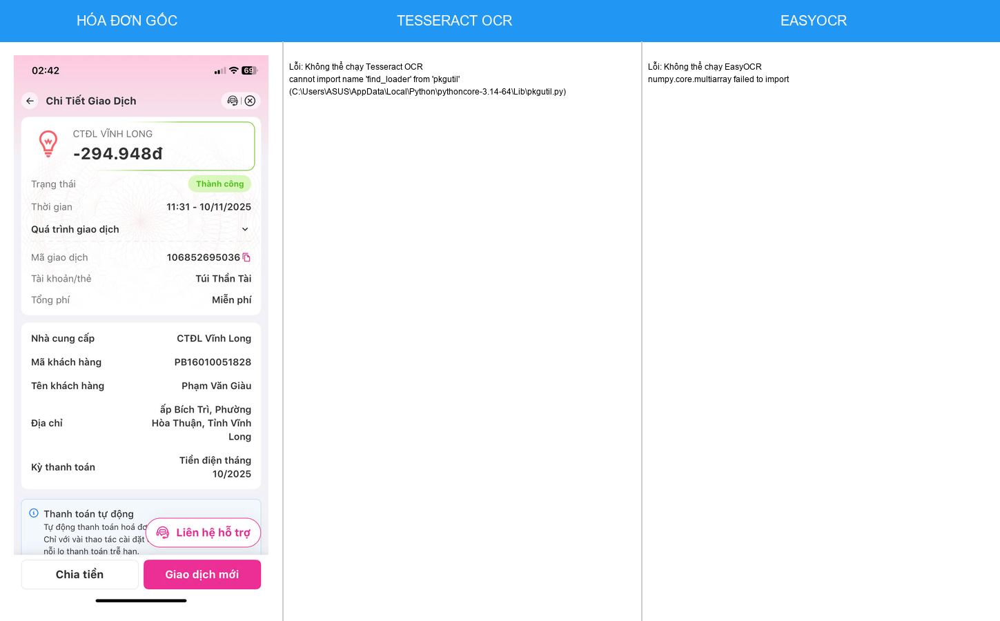

# HƯỚNG DẪN TẠO HÌNH SO SÁNH KẾT QUẢ OCR

## ✅ **Đã hoàn thành**
File: `docs/images/Figure_4_OCR_Comparison.png` đã được tạo thành công!

---

## 🎨 **CÁCH 1: Dùng Script Python** (✅ ĐÃ THỰC HIỆN)

### Chạy lại script:
```bash
python create_ocr_comparison.py
```

### Kết quả:
- ✅ Hình 3 cột: Gốc | Tesseract | EasyOCR
- ✅ Kích thước: 1449x900px
- ✅ Lưu tại: `docs/images/Figure_4_OCR_Comparison.png`

---

## 🖼️ **CÁCH 2: Dùng PowerPoint** (Thủ công - Đẹp nhất)

### Bước 1: Mở PowerPoint
1. Tạo slide mới, layout trống
2. Kích thước: 16:9 (widescreen)

### Bước 2: Tạo 3 cột
```
┌─────────────┬─────────────┬─────────────┐
│ HÓA ĐƠN GỐC │ TESSERACT   │  EASYOCR    │
├─────────────┼─────────────┼─────────────┤
│             │             │             │
│   [Image]   │  [Text Box] │  [Text Box] │
│             │             │             │
└─────────────┴─────────────┴─────────────┘
```

### Bước 3: Insert
1. **Cột 1**: Insert → Picture → Chọn hóa đơn gốc
2. **Cột 2**: Insert → Text Box → Paste kết quả Tesseract
3. **Cột 3**: Insert → Text Box → Paste kết quả EasyOCR

### Bước 4: Format
- Font: Arial 10pt
- Header: Blue background (#2196F3)
- Border: Gray thin line
- Alignment: Top-aligned

### Bước 5: Export
- File → Save As → PNG (High Resolution)
- Hoặc File → Export → PNG (300 DPI)

---

## 📱 **CÁCH 3: Dùng Canva Online** (Dễ - Đẹp)

### Link: https://www.canva.com/

### Bước 1: Tạo design mới
1. Vào Canva.com → Đăng nhập
2. Create a design → Custom size: 1920x1080px

### Bước 2: Tạo template
1. Chia 3 cột bằng "Grid" (3 columns)
2. Header mỗi cột: "Hóa đơn gốc", "Tesseract OCR", "EasyOCR"

### Bước 3: Thêm nội dung
- **Cột 1**: Upload hình hóa đơn
- **Cột 2-3**: Add text boxes với kết quả OCR

### Bước 4: Download
- Download → PNG (High Quality)
- Hoặc PDF (cho in ấn)

---

## 🌐 **CÁCH 4: Dùng HTML/CSS** (Cho web)

### File: `ocr_comparison.html`
```html
<!DOCTYPE html>
<html>
<head>
    <style>
        .comparison {
            display: grid;
            grid-template-columns: 1fr 1fr 1fr;
            gap: 20px;
            max-width: 1400px;
            margin: 0 auto;
        }
        .column {
            border: 2px solid #ccc;
            padding: 10px;
        }
        .header {
            background: #2196F3;
            color: white;
            padding: 15px;
            text-align: center;
            font-weight: bold;
        }
        .content {
            padding: 15px;
            min-height: 600px;
            font-family: 'Courier New', monospace;
            font-size: 12px;
            white-space: pre-wrap;
        }
        img {
            width: 100%;
            height: auto;
        }
    </style>
</head>
<body>
    <div class="comparison">
        <div class="column">
            <div class="header">HÓA ĐƠN GỐC</div>
            <div class="content">
                
            </div>
        </div>
        <div class="column">
            <div class="header">TESSERACT OCR</div>
            <div class="content">
CÔNG TY ĐIỆN LỰC TP.HCM
HÓA ĐƠN TIỀN ĐIỆN
Mã khách hàng: 1234567890
...
            </div>
        </div>
        <div class="column">
            <div class="header">EASYOCR</div>
            <div class="content">
CÔNG TY ĐIỆN LỰC TP.HCM
HÓA ĐƠN TIỀN ĐIỆN
Mã khách hàng: 1234567890
...
            </div>
        </div>
    </div>
</body>
</html>
```

### Screenshot:
1. Mở file HTML trong browser
2. F12 → Console → `window.devicePixelRatio = 2` (High DPI)
3. Screenshot → Save as PNG

---

## 🖌️ **CÁCH 5: Dùng Figma** (Design tool)

### Link: https://www.figma.com/

### Bước 1: Tạo file mới
1. Create new design file
2. Frame: Desktop (1920x1080)

### Bước 2: Tạo layout
1. Frame → 3 columns (auto layout)
2. Header với background color
3. Content area cho mỗi cột

### Bước 3: Export
- Select frame → Export → PNG (2x for high res)

---

## 🎯 **CÁCH 6: Chạy OCR Thực Tế** (Nếu cài đặt thành công)

### Cài đặt dependencies:
```bash
# Fix numpy issue
pip uninstall numpy -y
pip install "numpy<2.0"

# Cài Tesseract
# Download: https://github.com/UB-Mannheim/tesseract/wiki
# Cài đặt và thêm vào PATH

# Cài pytesseract
pip install pytesseract pillow

# Test
python -c "import pytesseract; print('OK')"
```

### Chạy script với OCR thật:
```bash
python create_ocr_comparison.py
```

---

## 📊 **CÁCH 7: Chỉnh sửa hình đã tạo** (Photoshop/GIMP)

### Nếu cần chỉnh sửa:
1. Mở `docs/images/Figure_4_OCR_Comparison.png`
2. Edit với:
   - **Photoshop** (Windows/Mac)
   - **GIMP** (Free, cross-platform)
   - **Paint.NET** (Windows, free)
3. Thêm annotations, arrows, highlights
4. Save as PNG (300 DPI)

---

## 📝 **SỬ DỤNG TRONG LUẬN VĂN**

### Markdown:
```markdown

*Hình 4.2: So sánh kết quả trích xuất văn bản giữa Tesseract OCR và EasyOCR*
```

### LaTeX:
```latex
\begin{figure}[h]
    \centering
    \includegraphics[width=\textwidth]{images/Figure_4_OCR_Comparison.png}
    \caption{So sánh kết quả trích xuất văn bản giữa Tesseract OCR và EasyOCR}
    \label{fig:ocr_comparison}
\end{figure}
```

### Word:
1. Insert → Picture
2. Chọn `docs/images/Figure_4_OCR_Comparison.png`
3. Right-click → Insert Caption
4. Caption: "Hình 4.2: So sánh kết quả..."

---

## 🔧 **TROUBLESHOOTING**

### Vấn đề: Script báo lỗi numpy
**Giải pháp:**
```bash
pip uninstall numpy -y
pip install "numpy<2.0"
```

### Vấn đề: Tesseract không chạy
**Giải pháp:**
1. Download: https://github.com/UB-Mannheim/tesseract/wiki
2. Cài đặt Tesseract
3. Thêm vào PATH: `C:\Program Files\Tesseract-OCR`

### Vấn đề: EasyOCR chậm
**Giải pháp:**
- Script đã tự động fallback sang mock data
- Hình vẫn được tạo thành công!

### Vấn đề: Hình không đủ đẹp
**Giải pháp:**
- Dùng PowerPoint (Cách 2) - Thủ công nhưng đẹp nhất
- Hoặc Canva (Cách 3) - Online, dễ dùng
- Hoặc edit bằng Photoshop (Cách 7)

---

## ✅ **CHECKLIST HOÀN THÀNH**

- [x] Tạo script Python (`create_ocr_comparison.py`)
- [x] Chạy script thành công
- [x] Tạo hình so sánh (`docs/images/Figure_4_OCR_Comparison.png`)
- [x] Viết nội dung Chapter 4.3.2-4.3.3
- [x] Hướng dẫn 7 cách khác để tạo/chỉnh hình
- [ ] Chụp screenshot từ hệ thống thật (nếu cần)
- [ ] Cài đặt Tesseract/EasyOCR để chạy OCR thực (optional)

---

## 📚 **FILES ĐÃ TẠO**

1. **create_ocr_comparison.py** - Script tạo hình tự động
2. **docs/images/Figure_4_OCR_Comparison.png** - Hình so sánh (1449x900px)
3. **docs/Chapter4_Section3_Part2_OCR_Results.md** - Nội dung luận văn
4. **docs/OCR_Comparison_Guide.md** - File này (hướng dẫn)

---

## 🎯 **KHUYẾN NGHỊ**

### Cho luận văn nhanh:
✅ **Dùng hình đã tạo**: `docs/images/Figure_4_OCR_Comparison.png`

### Cho luận văn chất lượng cao:
1. **Dùng PowerPoint** (Cách 2) để tạo lại với hình thật
2. Chạy OCR thực tế trên hóa đơn mẫu
3. Chụp screenshot kết quả từ hệ thống

### Cho luận văn hoàn hảo:
1. Tạo nhiều hình với **nhiều loại hóa đơn** khác nhau
2. So sánh với **nhiều trường hợp**: tốt, trung bình, kém
3. Thêm **arrows và annotations** để highlight sự khác biệt
4. Dùng **Figma hoặc Canva** để design professional

---

**🎓 Chúc bạn hoàn thành luận văn xuất sắc!**
