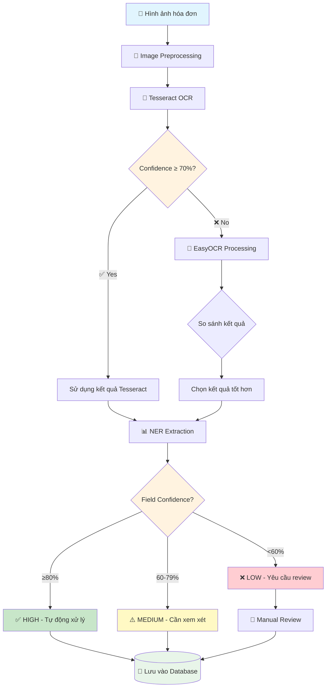
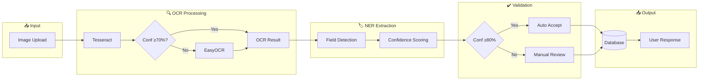
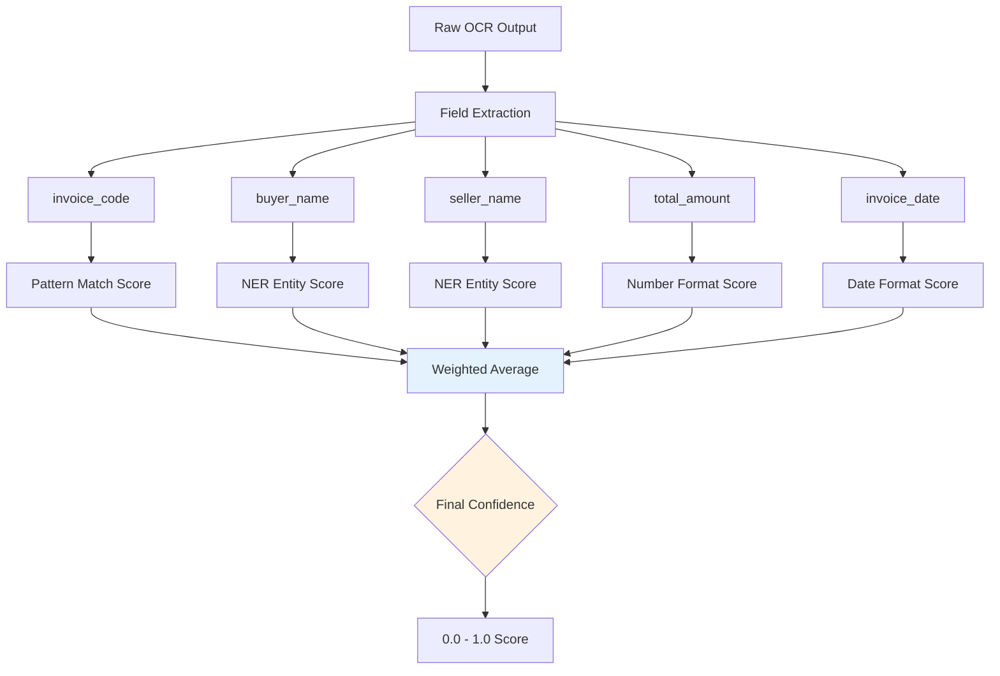
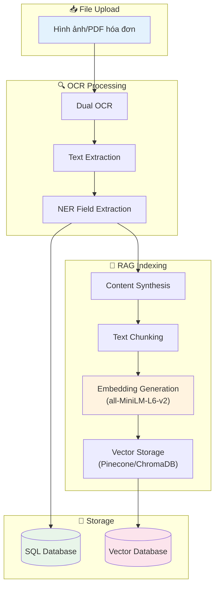
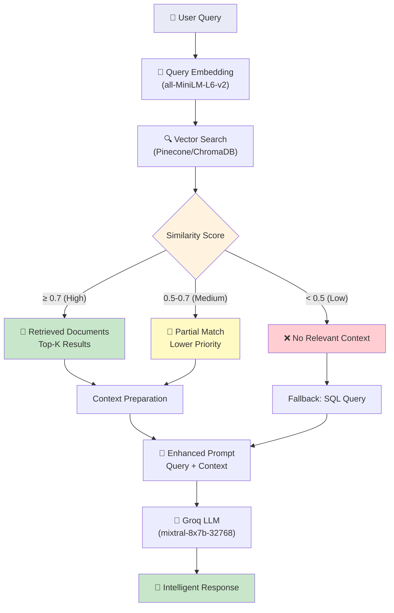
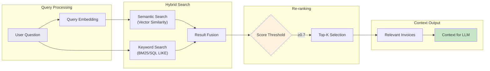

# Sơ đồ Pipeline với Confidence Threshold

## 1. Dual OCR Pipeline



## 2. Chi tiết Confidence Thresholds

### OCR Level (Tesseract vs EasyOCR)

| Threshold | Hành động | Tỷ lệ trigger |
|-----------|-----------|---------------|
| **≥ 70%** | Dùng Tesseract (fast path) | 83% |
| **< 70%** | Trigger EasyOCR fallback | 17% |

### Field Extraction Level

| Confidence | Icon | Trạng thái | Hành động |
|------------|------|------------|-----------|
| **≥ 80%** | ✅ | HIGH | Tự động chấp nhận |
| **60-79%** | ⚠️ | MEDIUM | Cảnh báo, cần xem xét |
| **< 60%** | ❌ | LOW | Yêu cầu review thủ công |

## 3. End-to-End Pipeline với Confidence Scoring



## 4. Confidence Score Calculation



## 5. RAG Pipeline Chi Tiết

### 5.1. RAG Indexing Pipeline (Khi Upload Hóa Đơn)



### 5.2. RAG Query Pipeline (Khi Tra Cứu/Chat)



### 5.3. RAG Hybrid Search Flow



## 6. Kết quả thực tế

```
📊 Production Statistics (30 days)

OCR Processing:
├─ Total invoices:        8,547
├─ Tesseract only:       7,124 (83.4%)  ✅ Confidence ≥70%
├─ EasyOCR triggered:    1,423 (16.6%)  ⚠️ Confidence <70%
│  └─ Improved result:   1,178 (82.8%)
└─ Manual correction:      127 (1.5%)   ❌ Confidence <60%

Accuracy Metrics:
✅ CAR (Character Accuracy Rate): 97.3%
✅ Full automation rate:          98.5%
✅ Average processing time:       2.15s
```

---

**Threshold Configuration:**
- OCR Fallback Threshold: `70%`
- High Confidence: `≥80%`
- Medium Confidence: `60-79%`
- Low Confidence: `<60%`
- RAG Similarity Threshold: `0.7`
